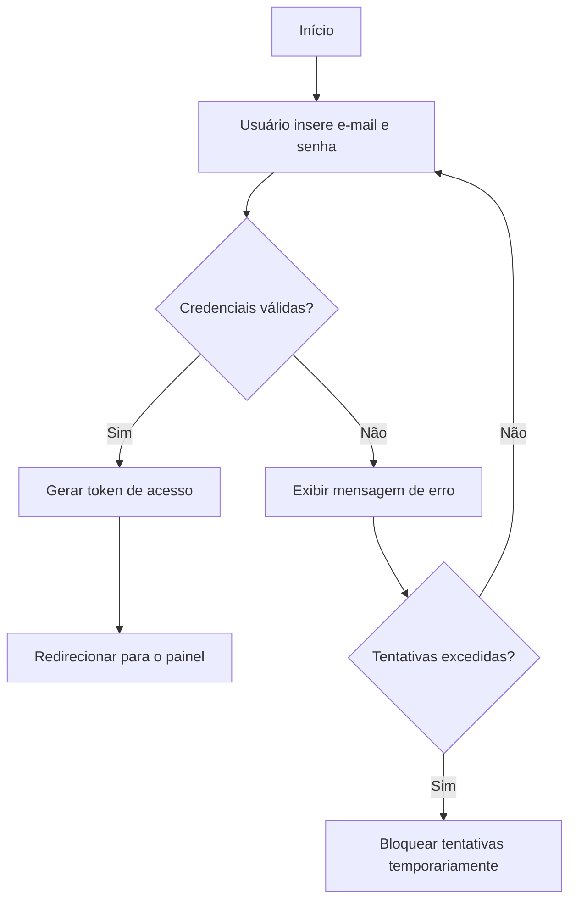

# Lista de Exercícios — Práticas de Escrita Técnica

## Exercício 1: Descrição clara e concisa de instalação de software

**Software escolhido: Git**

### Instalação do Git no Windows

1. Acesse [git-scm.com](https://git-scm.com) e baixe o instalador.
2. Execute o arquivo baixado e mantenha as opções padrão durante a instalação.
3. Abra o terminal e confirme a instalação com:
   ```bash
   git --version
   ```
4. Configure seu nome e e-mail, usados nos commits:
   ```bash
   git config --global user.name "Seu Nome"
   git config --global user.email "seu@email.com"
   ```

Essa descrição aplica diretamente as diretrizes do material: **frases curtas**, **voz ativa** ("Acesse", "Execute", "Configure" em vez de "deve ser acessado") e **estrutura lógica** progressiva, partindo do download até a validação final via terminal.

---

## Exercício 2: Reescrita de parágrafo

**Antes:**
> "O sistema permite que os usuários façam upload de arquivos, que serão armazenados no servidor para que, posteriormente, os administradores possam acessá-los."

**Depois:**
> "Usuários enviam arquivos pelo sistema. O servidor armazena os arquivos, e administradores podem acessá-los quando necessário."

**O que foi alterado:**
- A frase original tinha uma única sentença longa com duas subordinadas encadeadas por vírgulas ("que serão armazenados... para que, posteriormente..."); a versão reescrita divide isso em duas frases curtas e diretas.
- A voz passiva ("serão armazenados") foi substituída por voz ativa ("O servidor armazena"), deixando claro quem executa cada ação.
- A expressão "posteriormente" foi trocada por "quando necessário", eliminando uma palavra que não acrescenta informação prática ao leitor.

---

## Exercício 3: Organização de instruções com títulos, subtítulos e listas ordenadas

# Configuração do Ambiente Node.js

## Passo 1: Instalação do Node.js

1. Acesse o site oficial [nodejs.org](https://nodejs.org).
2. Baixe a versão recomendada para seu sistema operacional.
3. Execute o instalador e siga as etapas indicadas.

## Passo 2: Configuração das Variáveis de Ambiente

1. Localize o caminho de instalação do Node.js no seu sistema.
2. Adicione esse caminho à variável de ambiente `PATH`.
3. Reinicie o terminal para aplicar as alterações.

## Passo 3: Verificação da Instalação

1. Abra o terminal.
2. Execute o comando:
   ```bash
   node --version
   ```
3. Confirme que a versão exibida corresponde à instalada.

## Passo 4: Criação do Projeto

1. Navegue até o diretório desejado.
2. Execute o comando:
   ```bash
   npm init
   ```
3. Preencha as informações solicitadas ou pressione Enter para aceitar os valores padrão.

Cada etapa virou um título de nível 2 (`##`), reforçando a hierarquia visual mencionada no material, e os itens internos passaram a ser listas ordenadas, já que representam ações que precisam ocorrer em sequência — diferente de uma lista não ordenada, que serviria para itens sem dependência entre si.

---

## Exercício 4: Exemplo de código com explicação de uso

### Função: calcular desconto de um produto

```javascript
function calcularDesconto(preco, percentual) {
  const valorDesconto = preco * (percentual / 100);
  return preco - valorDesconto;
}
```

**Como utilizar:**

A função `calcularDesconto` recebe dois parâmetros: `preco`, o valor original do produto, e `percentual`, o desconto a ser aplicado (em uma escala de 0 a 100). Ela retorna o preço final já com o desconto subtraído.

```javascript
const precoFinal = calcularDesconto(200, 15);
console.log(precoFinal); // 170
```

No exemplo acima, um produto de R$ 200 com 15% de desconto resulta em R$ 170. Essa função pode ser reaproveitada em qualquer parte do sistema que precise aplicar descontos — por exemplo, em uma página de carrinho de compras ou em um relatório de promoções — sem repetir a lógica de cálculo em múltiplos lugares.

Essa explicação segue a recomendação de **simplificação**: a função foi descrita pelo que ela faz e por um exemplo numérico, sem detalhar conceitos básicos de JavaScript que o público de desenvolvedores já domina.

---

## Exercício 5: Diagrama de fluxo do processo de login

O fluxo abaixo representa as etapas desde a entrada de dados até o resultado final do processo de autenticação:



**Leitura do fluxo:**

- O processo começa na entrada de dados (e-mail e senha).
- A verificação das credenciais é o ponto de decisão central: se válidas, o sistema gera um token e redireciona o usuário; se inválidas, exibe uma mensagem de erro.
- Em caso de erro, há um segundo ponto de decisão: se o número de tentativas ainda está dentro do limite, o usuário retorna à tela de login; se excedeu o limite, o sistema bloqueia novas tentativas por um período, prevenindo ataques de força bruta.

Esse tipo de diagrama é especialmente útil em documentação técnica porque substitui uma descrição textual longa de regras condicionais por uma representação visual direta — o leitor identifica em segundos os pontos de decisão do sistema, algo que um parágrafo descritivo levaria várias frases para transmitir com a mesma clareza.
